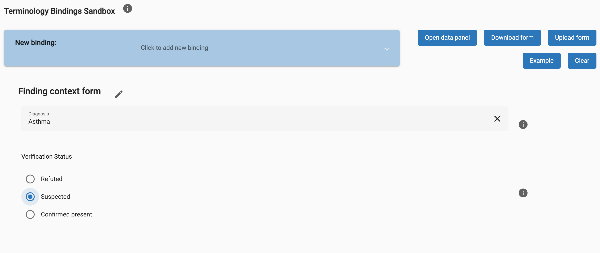
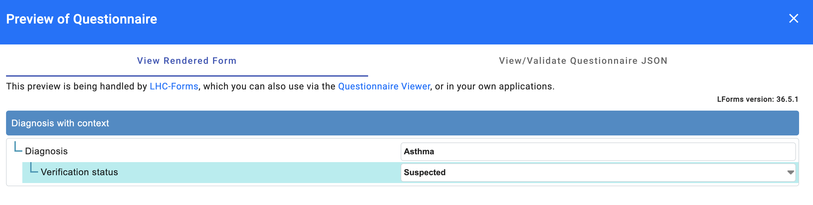

# 6.2 Context aware data capture and storage

Designing user interfaces for data capture that effectively represents context is a critical aspect of developing interoperable healthcare systems. This process involves defining sets of related fields that are bound to SNOMED CT. By carefully structuring these fields and their relationships, we ensure that the context in which data is captured is accurately represented and preserved. This enhances the data's quality and facilitates seamless data exchange between different systems and applications.

There are two primary approaches to achieving context representation in user interfaces. The first involves software designers incorporating context-aware elements during the UI development phase. In this method, developers define and hard-code the sets of related fields and their specific terminology bindings directly into the user interface. This approach allows for precise control over the data capture process but may require significant effort to update or modify as clinical practices evolve.

The second approach utilizes dynamic user interface generators that support the creation of data entry templates. These generators enable the development of flexible interfaces where templates can be designed and adjusted without extensive programming. Healthcare providers can customize data entry forms using templates to capture the appropriate context level for each use case. This method supports adaptability across different sections of clinical records and accommodates the varying needs of medical specialties, enhancing usability and efficiency.

We have developed a terminology binding sandbox to demonstrate the practicality of dynamic interfaces with terminology bindings. This tool supports the creation of dynamic user interfaces with SNOMED CT terminology bindings, demonstrating how a library of templates could be created. This example shows how it is possible to design templates to provide the appropriate level of context representation for various data entry scenarios. Whether used in different sections of clinical records or tailored for specific medical specialties, a template designer tool similar to this sandbox enables users to generate context-aware interfaces that improve data accuracy and interoperability.

<https://ihtsdo.github.io/sct-implementation-demonstrator/#/sandbox>

<figure><figcaption>
Figure 6.2-1: A screenshot of Diagnosis context data capture form in the terminology UI sandbox
</figcaption></figure>

## FHIR Questionnaires for Context Data Capture

FHIR Questionnaires offer a robust and standardized method for creating data capture forms that are both interoperable and context-aware. As part of the HL7 FHIR standard, the Questionnaire resource allows for the definition of structured forms, including questions, response options, and complex logic for conditional display and validation. By utilizing FHIR Questionnaires, developers can create forms that are consistent across different systems and capable of capturing detailed context information tied to standardized terminologies like SNOMED CT. Content entered in FHIR Questionnaires can be exported into other FHIR resources, such as Conditions or Observations, enabling further transformations if necessary.

Recognizing the importance of integrating SNOMED CT into these standardized forms, SNOMED International has collaborated with the National Library of Medicine (NLM) to enhance [LHC-forms builder tool](https://lhncbc.nlm.nih.gov/LHC-research/LHC-projects/health-information/lhc-forms.html) with full support for SNOMED CT. This collaboration has resulted in a more powerful forms builder that enables users to seamlessly incorporate SNOMED CT concepts into FHIR Questionnaires. The enhanced tool allows for precise terminology bindings and integration with terminology servers, ensuring that the data captured aligns with international standards and can be effectively exchanged and interpreted across diverse healthcare systems.

<figure><figcaption>
Figure 6.2-2: A screenshot of the preview of a context capture form created as a FHIR Questionnaire in the LHC-Forms app
</figcaption></figure>

  

Moreover, SNOMED International has developed a [Questionnaire repository and validation application](https://ihtsdo.github.io/sct-implementation-demonstrator/#/questionnaires) to further support the adoption of standardized data capture forms. This application allows the use of any FHIR server as a repository for a collection of FHIR Questionnaires designed with SNOMED CT integration, providing a valuable resource for healthcare organizations looking to implement standardized forms efficiently. The validation app complements this repository by allowing users to verify that the terminology bindings in their Questionnaires refer to current concepts in SNOMED CT latest releases.

## Data storage considerations

Data storage considerations are pivotal when managing context-aware data capture and retrieval. One option is to develop an **ad-hoc data model** , where you create custom schemas tailored to the specific needs of your application. This approach allows for precise control over how data and context are stored. However, it can be inflexible and challenging to scale or modify as requirements evolve, potentially leading to increased maintenance overhead.

Alternatively, you can store **flexible objects in a document database**. Document databases are designed to handle semi-structured data, making them well-suited for storing complex and dynamic data structures generated from user interfaces or templates. This method offers greater flexibility and ease of adaptation to changing data models without the need for extensive schema migrations. It allows developers to adjust the data structure as needed, accommodating new fields or context information seamlessly.

Another strategy is to **directly store FHIR resources** in their native format. Since FHIR resources inherently include both data and context within a standardized structure, storing them as-is ensures compatibility with other FHIR-compliant systems. This approach simplifies data management by leveraging the built-in interoperability of FHIR, reducing the need for additional data transformation during storage and retrieval. It facilitates easier data exchange and integration with other healthcare applications, promoting a more unified ecosystem.

<a href="https://docs.google.com/forms/d/e/1FAIpQLScTmbZIf0UEQwYDkY27EEWBkaiYkHSbR0_9DmFrMLXoQLyL7Q/viewform?usp=pp_url&entry.1767247133=NCPT+IG&entry.670899847=6.2%20Context%20aware%20data%20capture%20and%20storage" class="button primary">Provide Feedback</a>
