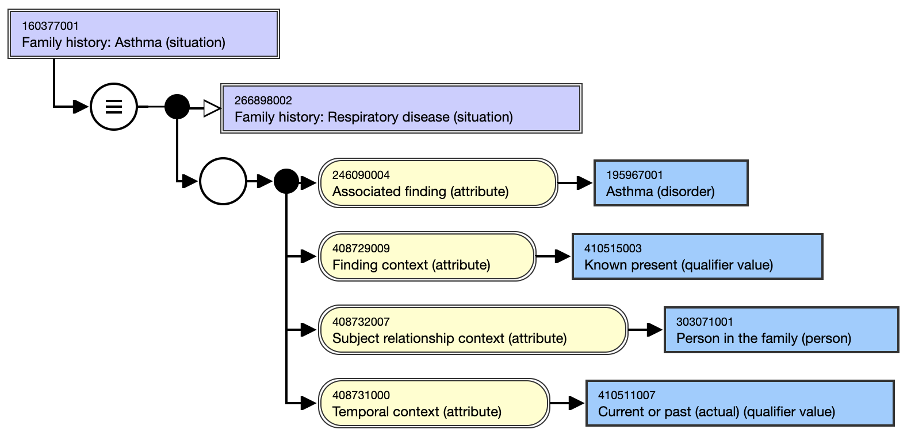
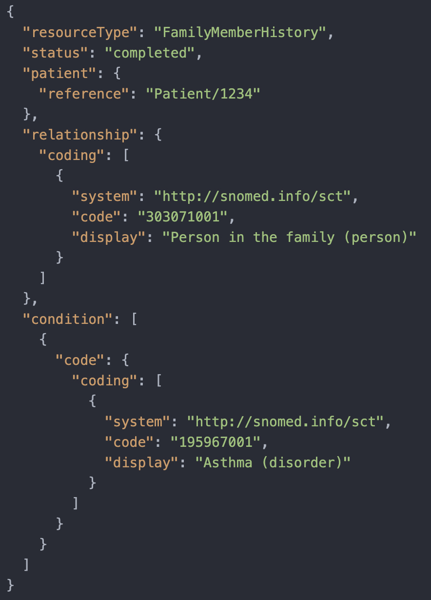

# 6.3 Context Representation Transformations

In today's interconnected digital ecosystem, the seamless exchange of information between diverse systems is more critical than ever. A fundamental obstacle to achieving true interoperability lies in how different systems represent context information about concepts. Some systems embed this context directly within the terminology, using codes with rich, nuanced meanings. Others represent context through their information models, structuring data to convey context via relationships and attributes. This disparity creates a landscape where data exchanged between systems may lose its intended meaning unless carefully transformed and interpreted.

This chapter focuses on the strategies and methodologies for implementing transformations between these heterogeneous models. We will delve into the technical challenges of mapping context from terminologies to information models and explore practical solutions to bridge these differences. By examining real-world scenarios and leveraging interoperability standards, we aim to equip you with the knowledge and tools necessary to ensure that context is preserved and accurately conveyed during data exchange. Understanding these transformation processes is essential for developers, architects, and stakeholders striving to enhance interoperability and achieve consistent, reliable communication across varied systems.

  

<figure></figure>

<figure></figure>

<figure><figcaption>
Figure 6.3-1: Example of a transformation from a "Situation with explicit context" concept to a FHIR FamilyMemberHistory Resource information model
</figcaption></figure>

  

  

  * [6.3.1 FHIR and SWEC Comparison](6.3.1-FHIR-and-SWEC-Comparison_278301535.html)
  * [6.3.2 Transformations between SWEC and FHIR](6.3.2-Transformations-between-SWEC-and-FHIR_278301536.html)

