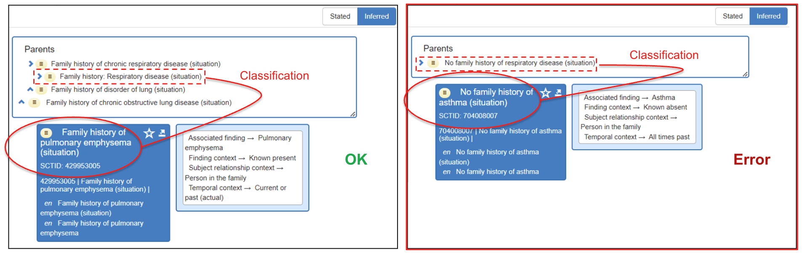

# The SNOMED CT Logical Profile's inability to Accurately Classify 'Absent' Findings

In the Situation with Explicit Context Hierarchy, there's an option to link a finding with a context value, indicating properties like the absence of a finding or the probability of a finding. This association is established through the Finding Context attribute.

However, attempting to represent absence (negation) or likelihood using a DL relationship such as "Finding Context" leads to significantly inaccurate outcomes in subsumption testing and terminology classifications.

<figure><figcaption>
The concept "No family history of asthma" cannot be directly inferred as a subtype of "No family history of respiratory disorder." Associating a person with "No family history of asthma" does not automatically imply an association with "No family history of respiratory disorder." This distinction arises because "No family history of respiratory disorder" encompasses a broader set of conditions, and a person could have a family history of other respiratory disorders, such as pulmonary edema, despite the absence of familial asthma connections. Therefore, linking an individual with "No family history of asthma" does not necessarily extend to the conclusion of "No family history of respiratory disorder."
</figcaption></figure>

  

  

