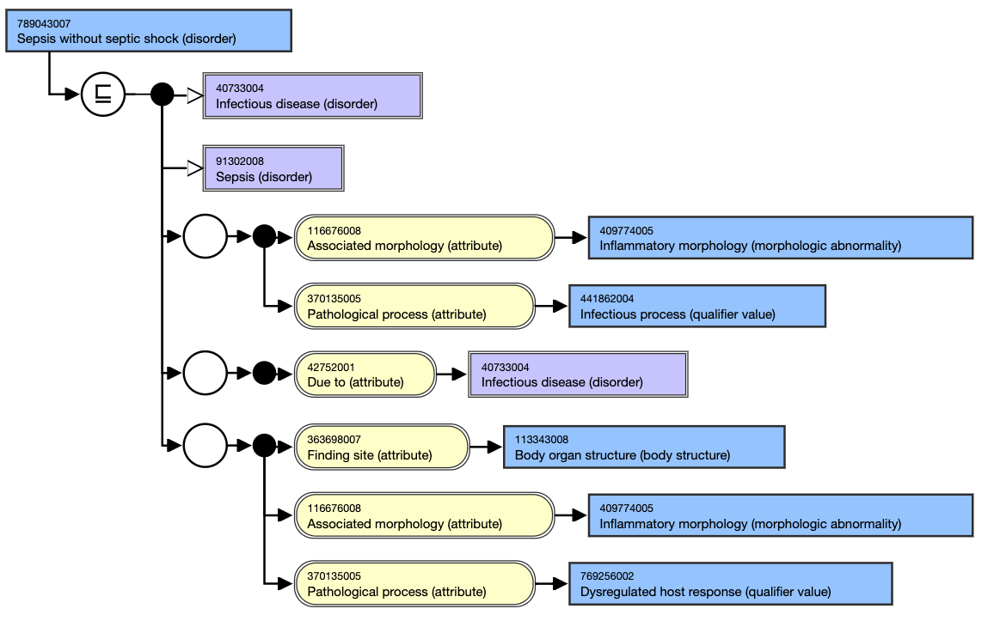
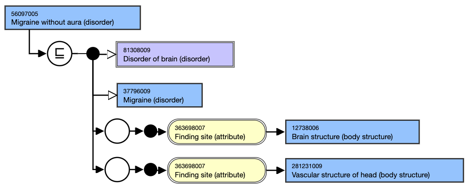
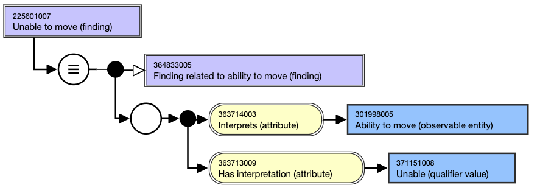
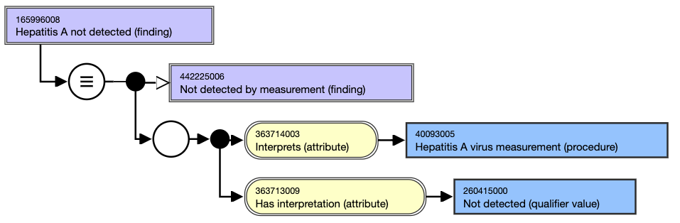

# Undesired Contextual Information in Clinical Finding and Procedure Hierarchy

Challenges in SNOMED CT arise due to including contextual information within specific concepts under the clinical finding and procedure hierarchy. This goes beyond the intended scope, causing inaccuracies in the content and functionality of the system.

Within SNOMED CT's clinical finding hierarchy, concepts depict outcomes resulting from observations, assessments, or judgments. This necessitates the ability to represent anomalies, including the absence of specific body structures or functional deficiencies. Consequently, a pertinent question arises regarding whether these diverse concepts should be categorized as contextual information.

The historical embedding of contextual details in Clinical finding and Procedure concepts allows for future adjustments, yet limitations within SNOMED CT's logical framework exacerbate these challenges. Defining what constitutes contextual factors is hard due to the broad range of clinical findings from evaluations and examinations. Therefore, determining the boundary between inherent information and contextual details within the terminology is complex and warrants thoughtful consideration in every SNOMED CT application.

## Clinical Finding Examples

Category| Example| Description  
---|---|---  
Absence of body structure| <figure></figure>|   
  
Exclusions| <figure></figure>|   
  
Without| <figure></figure>| The term "without" serves as a notable linguistic cue within SNOMED CT concepts, as seen in examples like 'Migraine without aura,' 'Sepsis without septic shock,' and 'Suture of skin without graft.' However, these specific concepts lack comprehensive definitions. This limitation is apparent because fully formalizing the meaning of "without" requires the ability to articulate negations, which isn't supported by the chosen formal logic employed in SNOMED CT. This reflects a constraint within SNOMED CT's functioning related to expressing negations.  
Functions /disabilities| <figure></figure>|   
  

<figure></figure>|   
  
Measurement results| <figure></figure>|   

